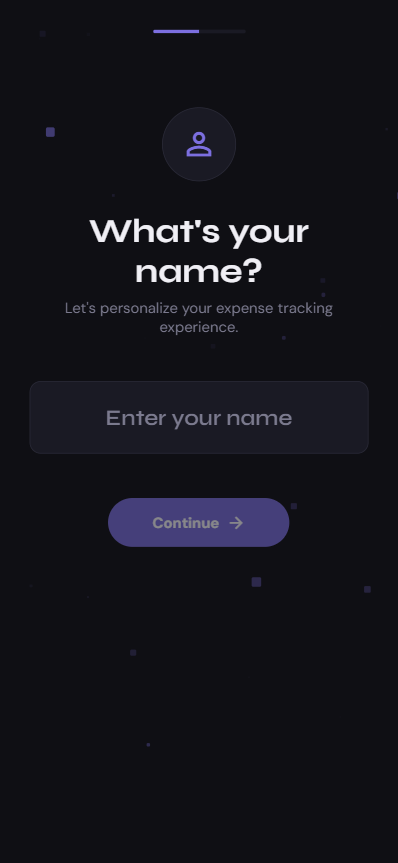
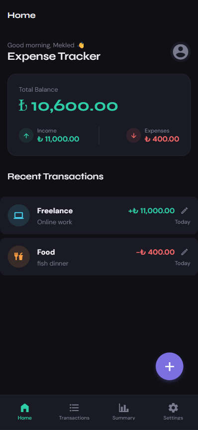
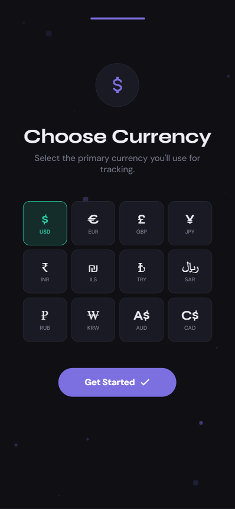
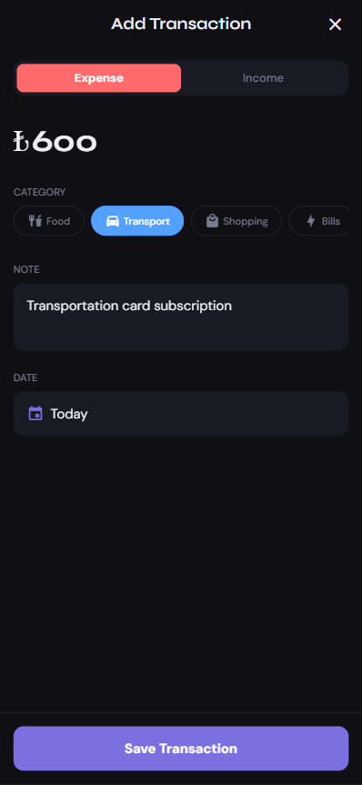
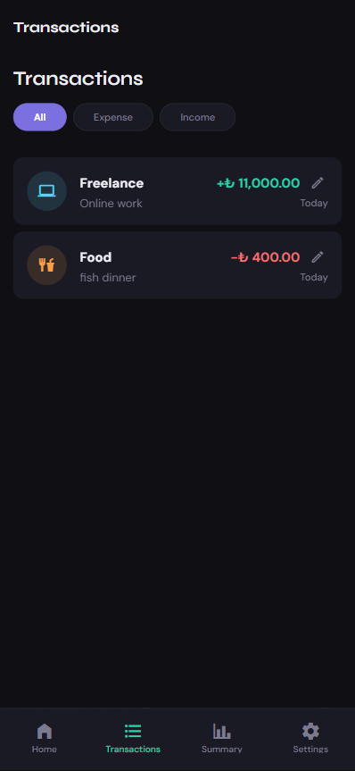
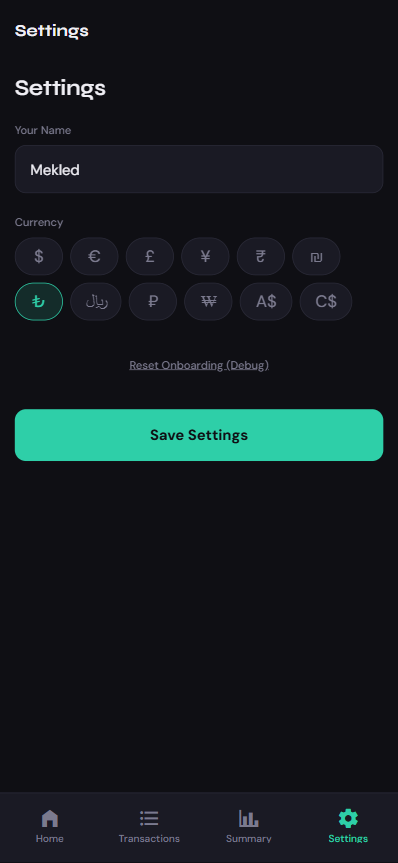
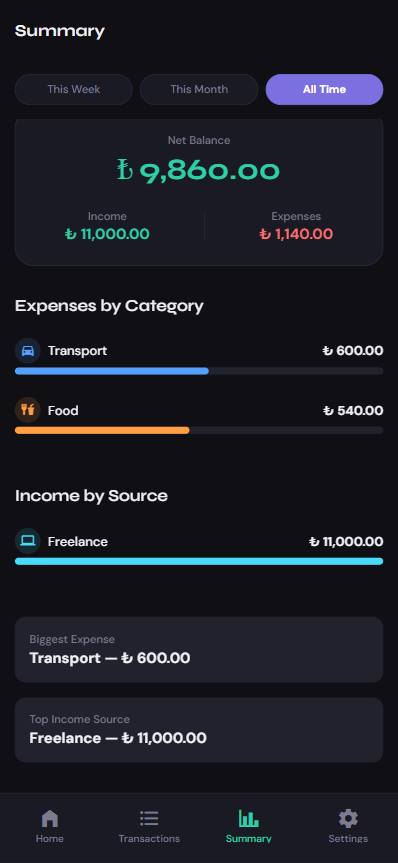

# Expense Tracker

A premium, dark-mode personal finance mobile app built with React Native and Expo.

## Features

- **Dashboard**: View your total balance, income, and expenses at a glance with a beautiful glassmorphism card.
- **Transaction History**: Browse all your transactions, filter by type, and manage your spending history.
- **Spending Summary**: Visualize your spending patterns with category-based progress bars and period filtering (Week, Month, All Time).
- **Easy Entry**: Fast and intuitive modal for adding both expenses and income with category icons.
- **Dark Fintech Theme**: A sleek, premium design using the Syne and DM Sans typography.
- **Interactive Onboarding**: A smooth multi-step onboarding flow to capture user name and preferred currency.
- **Pixel Blast Background**: A premium, dynamic background animation built with the React Native Animated API for a high-end feel.
- **Expanded Currencies**: Support for 12 major global currencies with ISO code identification.
- **Local Persistence**: Your data stays on your device using AsyncStorage.

## App Preview

<div align="center">
  
  
  
</div>

<br />

<div align="center">
  
  
  
  
</div>

## Tech Stack

- **Framework**: React Native + Expo (SDK 54)
- **Language**: TypeScript
- **Navigation**: React Navigation v7
- **State Management**: React Context
- **Storage**: AsyncStorage
- **Icons**: Expo Vector Icons (MaterialCommunityIcons)
- **Fonts**: Syne & DM Sans (Expo Google Fonts)

## Getting Started

1. **Clone the repository** (or navigate to the `expense-tracker` folder).
2. **Install dependencies**:
   ```bash
   npm install
   ```
3. **Start the project**:
   ```bash
   npx expo start
   ```
4. **Run on a device**:
   - Download the **Expo Go** app on your iOS or Android device.
   - Scan the QR code displayed in your terminal.

## Design Tokens

- **Background**: #0F0F14
- **Surface**: #1A1A24
- **Income (Teal)**: #2ECFA8
- **Expense (Coral)**: #FF6B6B
- **Accent (Purple)**: #7C6FE0

## Architecture

The project follows a feature-based folder structure:
- `src/components`: Reusable UI elements.
- `src/screens`: Main application screens.
- `src/context`: Global state management.
- `src/storage`: Data persistence layer.
- `src/utils`: Helper functions for calculations and formatting.
- `src/constants`: Theme tokens and category definitions.
